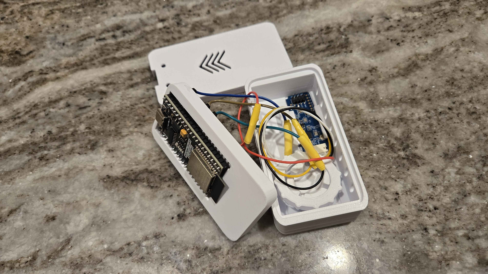
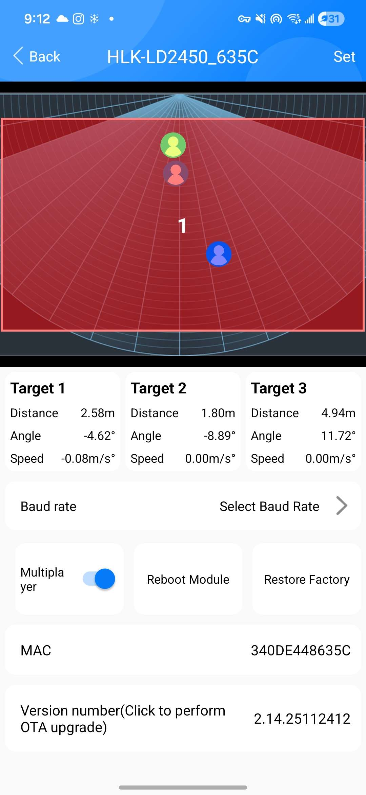
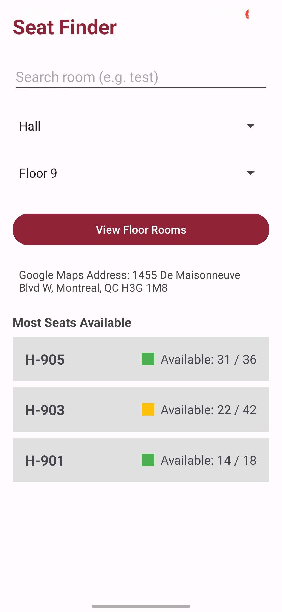
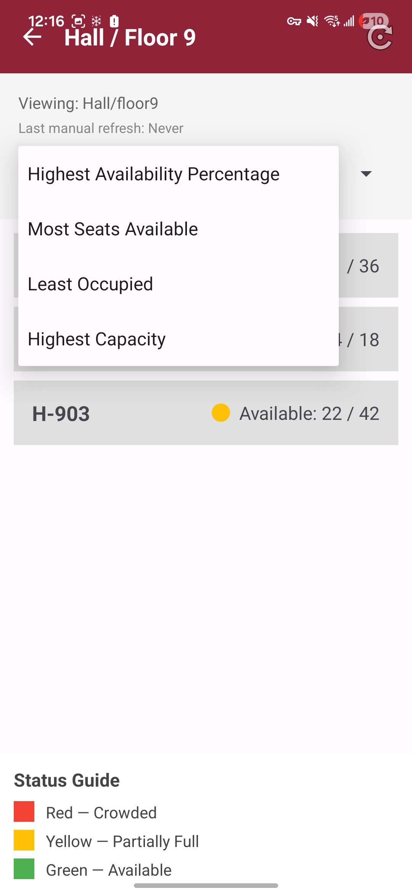
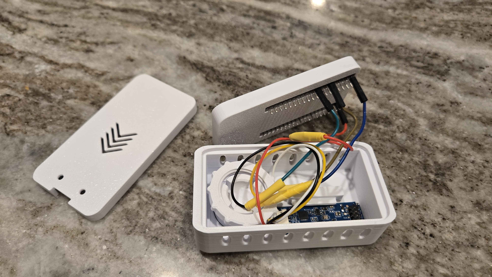

# SeatFindr – Smart Study Space Occupancy Monitoring System

**COEN/ELEC 390 Computer and Electrical Engineering Product Design Project — Concordia University**

## Project Overview

SeatFindr is an IoT-based occupancy monitoring system developed to help students identify available study spaces before physically travelling to them.

The system uses an **HLK-LD2450 24 GHz mmWave radar sensor** connected to an **ESP32** to monitor a defined seating area and detect up to three seated occupants. The ESP32 processes the sensor data and sends occupancy updates over Wi-Fi to a **Firebase Realtime Database**.

A native **Android application developed in Java/XML** retrieves the database values and displays room capacity, occupied seats, and available seats to the user.

The complete system integrates:

- mmWave occupancy sensing
- ESP32 embedded processing
- UART serial communication
- Wi-Fi communication
- Firebase Realtime Database
- Android application development
- real-time hardware/software integration

<p align="center">
  
</p>

---

## Problem

Finding an available study space on a busy university campus can require students to walk between multiple rooms, floors, or buildings without knowing whether seating is available.

SeatFindr was developed to provide students with occupancy information before they arrive at a study location.

The system was designed around three main ideas:

- provide useful seat-availability information in near real time
- minimize unnecessary searching for study spaces
- monitor occupancy without cameras or personally identifying users

---

## Objectives

The main objectives of the project were to:

- Detect seated occupants within a monitored study area
- Distinguish sustained occupancy from brief pass-through movement
- Track up to three occupants using the LD2450 sensor
- Process sensor data using an ESP32
- Transmit occupancy information wirelessly to a cloud database
- Display available seats through an Android application
- Organize occupancy data by building, floor, and room
- Provide intuitive room navigation, searching, sorting, and occupancy indicators
- Validate the complete sensor-to-application communication pipeline
- Design the system with privacy, scalability, and accessibility in mind

---

## System Architecture

The final prototype used the following end-to-end architecture:

```text
       Seated Occupants
              │
              ▼
   HLK-LD2450 mmWave Sensor
      Detects target motion
              │
              │ UART
              ▼
            ESP32
   Arduino IDE / C++ Firmware
   ├─ Parses radar data
   ├─ Applies occupancy logic
   ├─ Determines occupied seats
   └─ Connects to Wi-Fi
              │
              │ Wi-Fi
              ▼
   Firebase Realtime Database
   ├─ Room capacity
   └─ Current occupied seats
              │
              │ Real-time synchronization
              ▼
      Android Application
          Java / XML
   ├─ Retrieves Firebase data
   ├─ Calculates available seats
   ├─ Displays rooms and status
   └─ Provides search and sorting
              │
              ▼
             User
```

The Android application calculates seat availability using:

```text
Available Seats = Room Capacity - Occupied Seats
```

This architecture separates the physical sensing system from the mobile application while allowing both to communicate through a centralized real-time database.

---

## Hardware

### HLK-LD2450 mmWave Radar Sensor

The HLK-LD2450 is a **24 GHz mmWave radar sensor** capable of tracking up to three targets simultaneously.

Unlike camera-based monitoring, the sensor does not capture images, faces, audio, names, or student IDs. It detects motion and position information that can be used to determine whether people are present within the monitored seating zone.

The sensor communicates with the ESP32 through **UART serial communication**.

### ESP32

The ESP32 acts as the main embedded processing and communication unit.

Its responsibilities include:

- receiving LD2450 radar data
- parsing target information
- applying occupancy-detection logic
- filtering temporary or pass-through detections
- determining the current number of occupied seats
- connecting to Wi-Fi
- updating Firebase when occupancy changes

The ESP32 firmware was developed in **C++ using the Arduino IDE**.

---

## Occupancy Detection

The prototype focused on a defined **three-seat monitored micro-zone**.

The sensor continuously observes targets within the configured detection area. Rather than treating every detected movement as an occupied seat, the embedded logic evaluates sustained detections to reduce false occupancy changes caused by people briefly walking through or near the monitored area.

Testing included:

- one seated occupant
- two seated occupants
- three seated occupants
- people walking past the monitored zone
- target positioning and distance
- sensor placement and orientation
- false-detection behaviour

The prototype successfully demonstrated detection of up to **three seated occupants** within the monitored area.

<p align="center">
  
</p>

---

## Firebase Realtime Database

Firebase provides the communication layer between the physical sensing system and the Android application.

The ESP32 writes changing occupancy values to Firebase, while the Android application retrieves and displays the latest information.

The database was structured hierarchically around locations such as:

```text
University
└── Building
    └── Floor
        └── Room
            ├── capacity
            └── occupiedSeats
```

For the prototype, a room path could be represented as:

```text
/buildings/Hall/floor4/RoomA
```

This structure allows individual sensor units to be associated with specific rooms and provides a foundation for expansion to additional floors and buildings.

---

## Android Application

The SeatFindr Android application was developed using **Android Studio, Java, and XML**.

The application allows users to select or search for a building and floor, view available study rooms, and interpret room occupancy through numerical and visual indicators.

### Main Application Features

- Building and floor selection
- Smart building/floor search
- Input normalization and validation
- Support for partial and case-insensitive search inputs
- Scrollable multi-room display
- Available seats / total capacity display
- Occupancy status indicators
- Building address information
- Room sorting by:
  - availability percentage
  - seats available
  - seats occupied / occupancy level
- Manual Firebase refresh
- Real-time Firebase data updates
- Recommended rooms with high availability
- Navigation and help controls
- Occupancy status guide

<p align="center">
  
  &nbsp;&nbsp;&nbsp;
  
</p>

---

## Stakeholder-Driven Design

The project followed a user-centered engineering design process.

Students were interviewed to better understand:

- difficulties finding available study spaces
- expectations for occupancy accuracy
- desired update speed
- useful app features
- privacy concerns
- preferred methods of viewing room information

User feedback influenced later development.

For example, feedback encouraged the team to:

- display multiple rooms simultaneously
- improve navigation
- clarify near-real-time behaviour
- make occupancy information easier to interpret

---

## Agile / Scrum Development

The project was developed using an **Agile/Scrum-style workflow**.

Development was organized using:

- Product Backlog
- User Stories
- Story Points
- Sprint Backlogs
- Sprint Goals
- Task Estimates
- Definition of Done
- Iterative testing
- Sprint reviews and demonstrations

### Sprint 1

Established the core sensing-to-application pipeline:

```text
LD2450 → ESP32 → Firebase → Android
```

Major work included:

- sensor/ESP32 communication
- Firebase setup
- ESP32-to-Firebase synchronization
- Android application skeleton
- Firebase-to-Android communication
- initial sensor coverage simulation

### Sprint 2

Focused on improving reliability and usability:

- detection of up to three occupants
- sensor placement and calibration
- scrollable room interface
- room sorting
- occupancy status guide
- building address display
- smart search and validation
- end-to-end testing

### Sprint 3

Expanded the user interface and physical prototype:

- manual refresh functionality
- additional room sorting options
- room recommendations
- improved occupancy indicators
- interface refinements
- physical enclosure integration
- additional system testing

---

## Simulation

A computer simulation was used to examine sensor field-of-view coverage and help determine suitable sensor placement.

The simulation represented the seating area using a simplified 2D environment and was used to investigate:

- sensor field of view
- placement geometry
- blind spots
- monitored-zone boundaries
- detection outside the intended area
- possible overlap between sensors
- future multi-sensor scalability

The simulation helped narrow the prototype scope to a manageable three-seat monitored zone and reinforced the importance of sensor positioning.

---

## Testing and Validation

Testing was performed across the individual subsystems and the complete system.

### Sensor Testing

- Detected one seated occupant — **Pass**
- Detected two seated occupants — **Pass**
- Detected three seated occupants — **Pass**
- Ignored people outside / walking past the intended area — **Pass**

### ESP32 / Firebase Testing

- ESP32 Wi-Fi connection — **Pass**
- Occupancy values transmitted to Firebase — **Pass**
- Firebase values updated after occupancy changes — **Pass**

### Android Testing

- Firebase data retrieval — **Pass**
- Available-seat calculation — **Pass**
- Multi-room display — **Pass**
- Search and navigation — **Pass**
- Room sorting — **Pass**
- Manual refresh — **Pass**
- Occupancy indicators — **Pass**

### End-to-End Testing

The full pipeline was successfully demonstrated:

```text
Physical Occupancy Change
        ↓
LD2450 Detection
        ↓
ESP32 Processing
        ↓
Firebase Update
        ↓
Android Application Update
```

During testing, the Android application reflected Firebase occupancy changes within approximately **1–2 seconds after the database value changed**.

---

## Privacy and Ethical Considerations

Privacy was an important design requirement.

SeatFindr intentionally avoids camera-based occupancy monitoring and does not require personally identifiable information.

The prototype does **not** collect:

- photographs
- video
- audio
- faces
- names
- student IDs

The system only needs occupancy information required to determine whether monitored seating is available.

The project also considered:

- transparency about installed sensors
- database access control
- responsible use of occupancy information
- accessibility
- reliability and fairness
- preventing future misuse of occupancy data

---

## My Contributions

My primary contributions to the project included:

- Android application UI development
- Main activity and room-occupancy interface development
- Smart search implementation
- Search normalization and input validation
- Building and floor navigation logic
- Room sorting and filtering functionality
- Navigation, toolbar, help, and refresh features
- Firebase Realtime Database setup
- Initial Firebase JSON/database organization
- Firebase-to-Android application integration
- Initial ESP32 and LD2450 hardware integration using Arduino IDE
- Sensor testing and calibration
- End-to-end hardware/database/mobile integration testing
- Physical prototype support, including sourcing and 3D-printing an enclosure for the electronics

My largest contribution was in the **Android application and user-facing functionality**, while also contributing to the embedded hardware, Firebase backend, and complete IoT system integration.

---

## Technologies Used

### Hardware
- ESP32
- HLK-LD2450 24 GHz mmWave radar sensor
- 3D-printed prototype enclosure

### Embedded
- C++
- Arduino IDE
- UART
- Wi-Fi

### Cloud / Backend
- Firebase
- Firebase Realtime Database
- JSON data structure

### Mobile
- Android Studio
- Java
- XML
- Firebase Android SDK

### Engineering
- IoT system integration
- Sensor calibration
- Hardware/software integration
- System testing
- User-interface development
- Agile / Scrum
- Requirements and stakeholder analysis

---

## Repository Structure

```text
SeatFindr-Occupancy-Monitoring/
│
├── README.md
│
├── firmware/
│   └── ESP32 / LD2450 firmware
│
├── android-app/
│   └── Android Studio project
│
├── docs/
│   └── Project documentation
│
└── media/
    ├── Hardware photographs
    ├── Android screenshots
    ├── Sensor calibration images
    └── Prototype videos
```

---

## Hardware Prototype

<p align="center">
  
</p>


---

## Result

The project successfully demonstrated a complete IoT occupancy-monitoring pipeline combining:

**physical sensing → embedded processing → wireless communication → cloud storage → mobile visualization**

SeatFindr showed that a privacy-conscious mmWave sensing system could detect seated occupants, transmit occupancy information through Firebase, and provide students with useful study-space availability through an Android application.

The prototype provides a foundation for future expansion to larger monitored areas, additional rooms, multiple sensors, and broader smart-campus occupancy applications.
